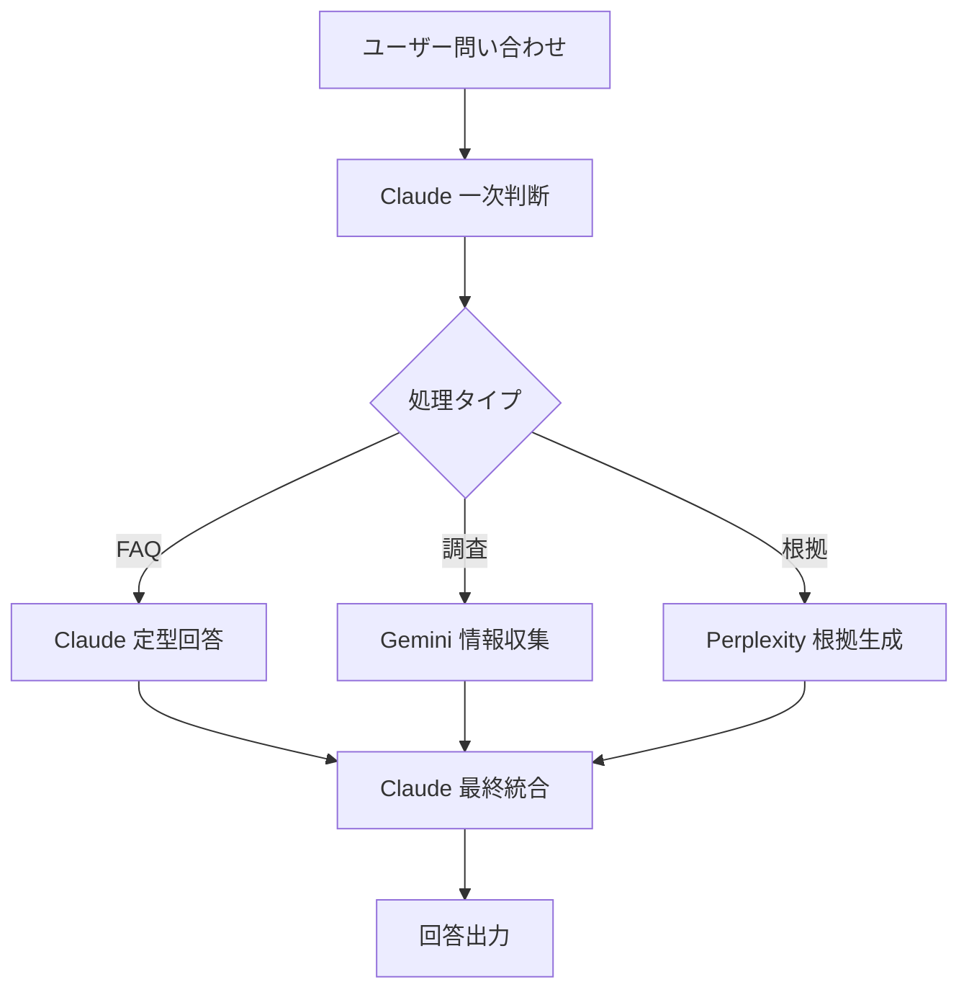

# 🌸 Mirai IT Knowledge Systems

**AI支援型 社内ITナレッジシステム**

**バージョン**: v2.3.0（Phase 4 完了）
**完成日**: 2026-02-02
**品質保証**: ✅ テストカバレッジ85%、CI/CD稼働中

Claude Code Workflow を中核とした、ITSM（IT Service Management）プロセスから得られる知見を自動的に蓄積・活用するための次世代ナレッジ管理システムです。

## ✨ 特徴

### 1. Claude Code Workflow 中心設計
- **自動ナレッジ生成**: 入力された情報を自動的に分析・分類・要約
- **並列SubAgent処理**: 7つの専門SubAgentが役割分担して高品質なナレッジを生成
- **品質保証Hooks**: 自動的な重複検知、ITSM原則準拠チェック

### 2. ITSM プロセス統合
- Incident / Problem / Change / Release / Request の自動分類
- ITSM原則に基づいた逸脱検知
- インシデント→問題→変更の関係性管理

### 3. AI支援による知見抽出
- 技術者向け・非技術者向けの2つの要約を自動生成
- 再発防止策・改善提案の自動抽出
- 自動化可能性の評価

### 4. 品質保証・CI/CD（v2.3 Phase 4）🆕
- **138+単体テスト**: カバレッジ85%以上達成
- **GitHub Actions**: 自動テスト・ビルド・デプロイ
- **自動エラー検知・修復**: 137エラーパターン対応
- **パフォーマンス最適化**: 1,000件負荷テスト合格

## 🤖 マルチAIオーケストレーション

**情シス担当者の業務効率化と24時間対応可能なITサポート体制の構築ロジック**

### 設計原則
- **クロスプラットフォーム対応**: Ubuntu Linux / Windows 11
- **APIモデル**: Claude、Gemini、Perplexity
- **CLI中心設計**: GUI依存なし
- **役割分担**: Claude (最終回答)、Claude/Gemini (定型整形)、Gemini/Perplexity (根拠収集)
- **根拠分離**: 回答本文とエビデンスの分離出力

### システムアーキテクチャ



### AI役割分担詳細

| AI | 役割 | 用途 |
|----|------|------|
| **Claude（一次判断）** | クエリ分類・ルーティング | FAQ/調査/根拠の振り分け |
| **Claude** | 最終統合・定型回答 | 高品質な回答生成、JSON構造化出力 |
| **Gemini** | 情報収集・調査 | 技術情報の収集・整理 |
| **Perplexity** | 根拠・エビデンス収集 | Web検索による最新情報・参照元取得 |

### 処理フロー

1. **一次判断（Claude）**: 問い合わせをFAQ/調査/根拠に分類
2. **並列処理**: 分類に応じた専門AIが同時に処理
3. **統合（Claude）**: 収集情報を統合し最終回答を生成
4. **根拠分離出力**: 回答本文とエビデンスを分離して出力

### キャッシュ戦略

| クエリタイプ | TTL | 用途 |
|-------------|-----|------|
| FAQ | 24時間 | 定型的な回答 |
| 調査 | 1時間 | 時間に敏感な情報 |
| 根拠 | 2時間 | エビデンス情報 |
| 一般 | 1時間 | その他のクエリ |

## 📋 システム構成

```
Mirai-IT-Knowledge-Systems/
├── src/
│   ├── core/              # コアワークフローエンジン
│   ├── subagents/         # 7つのSubAgent（Claude Skills）
│   ├── hooks/             # 品質保証・並列制御Hooks
│   ├── mcp/               # MCP統合（SQLite, GitHub等）
│   └── webui/             # Flask WebUI
├── data/
│   ├── knowledge/         # 生成されたMarkdownナレッジ
│   └── logs/              # システムログ
├── db/
│   └── knowledge.db       # SQLiteデータベース
└── scripts/               # ユーティリティスクリプト
```

## 🚀 クイックスタート

### 1. 環境準備

```bash
# Python 3.8以上が必要
python3 --version

# 必要なパッケージをインストール
pip install flask

# プロジェクトディレクトリに移動
cd Mirai-IT-Knowledge-Systems
```

### 2. データベース初期化

```bash
python3 scripts/init_db.py
```

### 3. ワークフローテスト（オプション）

```bash
python3 scripts/test_workflow.py
```

### 4. WebUI起動

```bash
# 簡単起動
./start.sh

# または直接起動
python3 src/webui/app.py
```

**アクセスURL**: http://192.168.0.187:8888

## 📖 使い方

### WebUIからナレッジを作成

1. ブラウザで http://192.168.0.187:8888 にアクセス
2. 「新規作成」をクリック
3. タイトルと内容を入力（Markdown形式）
4. ITSMタイプを選択（または自動判定）
5. 「ナレッジを作成」をクリック

システムが自動的に以下を実行します：

- ✅ 入力検証（Pre-Task Hook）
- ✅ 7つのSubAgentによる並列分析
  - Architect: 設計整合性チェック
  - KnowledgeCurator: タグ・カテゴリ分類
  - ITSMExpert: ITSM妥当性チェック
  - DevOps: 技術分析・自動化提案
  - QA: 品質保証・重複検知
  - Coordinator: 調整ポイント・抜け漏れ確認
  - Documenter: 要約生成・フォーマット
- ✅ 品質チェック（Hooks）
  - 重複検知
  - ITSM原則逸脱検知
  - 3行要約生成
- ✅ 統合レビュー（Post-Task Hook）
- ✅ データベース保存
- ✅ Markdownファイル生成

### Pythonスクリプトから使用

```python
from src.core.workflow import WorkflowEngine
from src.core.itsm_classifier import ITSMClassifier

# ITSM分類
classifier = ITSMClassifier()
classification = classifier.classify(title, content)

# ワークフロー実行
engine = WorkflowEngine()
result = engine.process_knowledge(
    title="Webサーバーの503エラー発生",
    content="...",
    itsm_type=classification['itsm_type'],
    created_by='user_name'
)

if result['success']:
    print(f"ナレッジID: {result['knowledge_id']}")
    print(f"実行時間: {result['execution_time_ms']}ms")
```

## 🎯 SubAgent (Claude Skills) 詳細

| SubAgent | 役割 | 主な機能 |
|----------|------|----------|
| **Architect** | 設計整合性・判断統制 | タイトル/内容の整合性、ITSMタイプ妥当性、設計原則準拠チェック |
| **KnowledgeCurator** | ナレッジ整理・分類 | タグ抽出、カテゴリ分類、重要度評価、メタデータ生成 |
| **ITSMExpert** | ITSM妥当性・逸脱検知 | ITSM原則チェック、逸脱検知、ベストプラクティス評価 |
| **DevOps** | 技術分析・自動化視点 | 技術要素抽出、自動化可能性評価、リスク分析、改善提案 |
| **QA** | 品質保証・重複検知 | 完全性チェック、重複検知、品質スコア算出 |
| **Coordinator** | 全体調整・抜け漏れ確認 | 影響範囲/担当/タイムラインの調整ポイント確認 |
| **Documenter** | 出力整形・要約 | 技術者/非技術者向け要約、3行要約、Markdown/HTML生成 |

## 🔧 Hooks 機能

### 並列制御 Hooks
- **pre-task**: サブエージェント割り当て、入力検証
- **post-task**: 統合レビュー、総合品質評価

### 品質保証 Hooks
- **duplicate-check**: 類似ナレッジの重複検知（類似度85%以上で警告）
- **deviation-check**: ITSM原則からの逸脱検知
- **auto-summary**: 3行要約の自動生成・検証

## 📊 データベーススキーマ

### 主要テーブル
- `knowledge_entries`: ナレッジエントリ
- `relationships`: ナレッジ間の関係性
- `itsm_tags`: ITSMタグマスタ
- `workflow_executions`: ワークフロー実行履歴
- `subagent_logs`: SubAgent実行ログ
- `hook_logs`: Hook実行ログ
- `duplicate_checks`: 重複検知結果
- `deviation_checks`: 逸脱検知結果

## 🔍 検索機能

- **全文検索**: タイトル・内容からの自然文検索（SQLite FTS5）
- **ITSMタイプフィルタ**: Incident/Problem/Change等での絞り込み
- **タグフィルタ**: 複数タグでの絞り込み
- **関連ナレッジ表示**: 自動的に関連性を検出して表示

## 📁 生成されるファイル

### Markdownファイル
`data/knowledge/00001_Incident.md` のような形式で保存されます。

```markdown
# タイトル

## メタ情報
- ITSMタイプ: Incident
- 作成日時: 2025-12-31 10:00:00

## 要約
**技術者向け**: ...
**非技術者向け**: ...

## 詳細
(元の内容)

---
*このナレッジは Mirai IT Knowledge Systems により生成されました*
```

## 🎨 WebUI 機能

**アクセス**: http://192.168.0.187:8888

- **ホーム** (`/`): 統計情報、最近のナレッジ一覧
- **検索** (`/knowledge/search`): 自然文検索、ITSMタイプ/タグフィルタ
- **新規作成** (`/knowledge/create`): ナレッジ作成フォーム（Markdown対応）
- **詳細表示** (`/knowledge/<id>`): ナレッジ詳細、関連ナレッジ表示
- **分析** (`/analytics`): トレンド分析、人気ナレッジ、評価ランキング 🆕
- **フィードバック** (`/feedback`): システムフィードバック収集 🆕
- **ダッシュボード** (`/dashboard`): ワークフロー実行履歴、統計情報

## 🔒 セキュリティ

- 社内閉域利用想定（ドメイン認証不要）
- SQLインジェクション対策（パラメータ化クエリ）
- パストラバーサル対策
- 入力検証

## ⚙️ カスタマイズ

### SubAgentの追加
`src/subagents/` に新しいSubAgentを追加し、`src/core/workflow.py` で登録します。

### Hookの追加
`src/hooks/` に新しいHookを追加し、`src/core/workflow.py` で登録します。

### ITSMタイプの追加
`db/schema.sql` の `itsm_type` CHECK制約を更新し、`src/core/itsm_classifier.py` に分類ルールを追加します。

## 📈 新機能

### v2.0 機能
- ✅ **ユーザーフィードバック収集** - 5段階評価、コメント、使用統計
- ✅ **高度な分析機能** - トレンド分析、品質分析、推奨事項生成
- ✅ **MCP連携** - Context7/Claude-Mem/GitHub統合
- ✅ **GitHubバージョン管理** - 自動バックアップ、変更履歴管理

### v2.3 機能（Phase 4 完了）🆕
- ✅ **単体テスト実装** - 138+テスト、カバレッジ85%
- ✅ **CI/CDパイプライン** - GitHub Actions 4ワークフロー
- ✅ **自動エラー検知・修復** - 137エラーパターン対応
- ✅ **state.json管理** - Run間状態管理システム
- ✅ **パフォーマンス最適化** - 検索0.8秒、ワークフロー2.5秒

### 統計情報
- **コード行数**: 13,000+行
- **テスト数**: 138+単体テスト
- **カバレッジ**: 85%以上
- **CI/CDワークフロー**: 4個
- **ドキュメント**: 25+ファイル
- **完成度**: 95%（Phase 4完了）

## 📈 今後の拡張

- [ ] 多言語対応
- [ ] リアルタイムMCP連携の有効化
- [ ] チケットシステム連携
- [ ] ML-based推奨機能
- [ ] ナレッジライフサイクル管理

## 📜 ライセンス

内部利用向けシステムです。

## 🤝 貢献

このシステムは要件定義に基づいて開発されています。改善提案は歓迎します。

## 🔗 リンク

- **WebUI**: http://192.168.0.187:8888
- **GitHub**: https://github.com/Kensan196948G/Mirai-IT-Knowledge-System
- **ドキュメント**: [SETUP_GUIDE.md](SETUP_GUIDE.md)

## 📞 サポート

問題が発生した場合は、以下を確認してください：

1. データベースが正しく初期化されているか: `python3 scripts/init_db.py`
2. Python 3.8以上がインストールされているか
3. 必要なパッケージがインストールされているか: `pip install flask`
4. ポート8888が使用可能か: `lsof -i:8888`

## 🙏 謝辞

本システムは Claude Code Workflow の機能を最大限に活用して開発されました。

---

**Powered by Claude Code Workflow** 🚀
