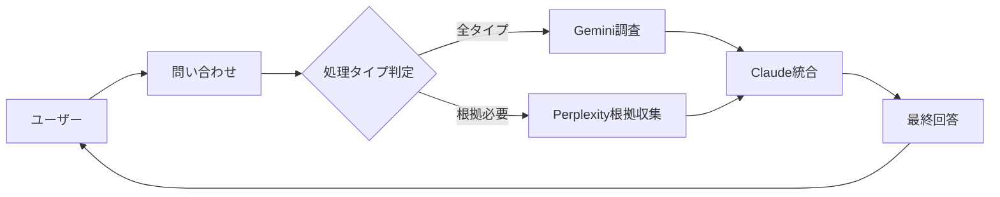

# 3つのAIエージェント構成

## 概要

本システムでは3つのAIモデルを役割分担させ、高品質な回答を生成します。
**OpenAI APIは使用せず**、Claude + Gemini + Perplexity の構成で運用します。

## AIモデル一覧

### 1. Anthropic Claude（プライマリ）

**役割**: 統合・最終回答生成

| 項目 | 内容 |
|------|------|
| モデル | claude-sonnet-4-20250514 |
| 用途 | 最終回答の生成、複数情報の統合、対話処理 |
| 特徴 | 高い文章生成能力、長文コンテキスト、安全性重視 |

```python
# 使用例
response = anthropic_client.messages.create(
    model="claude-sonnet-4-20250514",
    max_tokens=2000,
    messages=[{"role": "user", "content": query}]
)
```

### 2. Google Gemini

**役割**: 情報収集・調査

| 項目 | 内容 |
|------|------|
| モデル | gemini-2.0-flash |
| 用途 | 広範な情報収集、技術調査、トラブルシューティング |
| 特徴 | マルチモーダル対応、高速処理 |

```python
# 使用例
import google.generativeai as genai
model = genai.GenerativeModel('gemini-2.0-flash')
response = model.generate_content(query)
```

### 3. Perplexity

**役割**: 根拠生成・エビデンス収集

| 項目 | 内容 |
|------|------|
| モデル | sonar |
| 用途 | Web検索、根拠付き回答、ソース明示 |
| 特徴 | リアルタイム情報、URL付きエビデンス |

```python
# 使用例（OpenAI SDK互換）
from openai import OpenAI
client = OpenAI(
    api_key=perplexity_api_key,
    base_url="https://api.perplexity.ai"
)
response = client.chat.completions.create(
    model="sonar",
    messages=[{"role": "user", "content": query}]
)
```

## 処理フロー



## クエリタイプ別処理

| クエリタイプ | 使用AI | 処理内容 |
|-------------|--------|---------|
| FAQ | Gemini + Claude | 定型回答の生成 |
| Investigation | Gemini + Perplexity + Claude | 技術調査 + 根拠収集 + 統合 |
| Evidence | Gemini + Perplexity + Claude | 根拠付き回答生成 |
| General | Gemini + Claude | 一般的な問い合わせ対応 |

## API設定

環境変数での設定:

```bash
# .env.development / .env.production

# Anthropic (Claude) - プライマリ
ANTHROPIC_API_KEY=sk-ant-api03-...

# Google Gemini - 調査
GEMINI_API_KEY=AIzaSy...

# Perplexity - 根拠収集
PERPLEXITY_API_KEY=pplx-...

# OpenAI - 未使用
# OPENAI_API_KEY=（設定不要）
```

## コスト構造

| AI | 用途 | 課金形態 |
|----|------|---------|
| Claude | 統合処理 | 従量課金 |
| Gemini | 情報収集 | 無料枠あり |
| Perplexity | 根拠収集 | 従量課金 |

**OpenAI不使用により、ChatGPT Plus契約と独立して運用可能**
