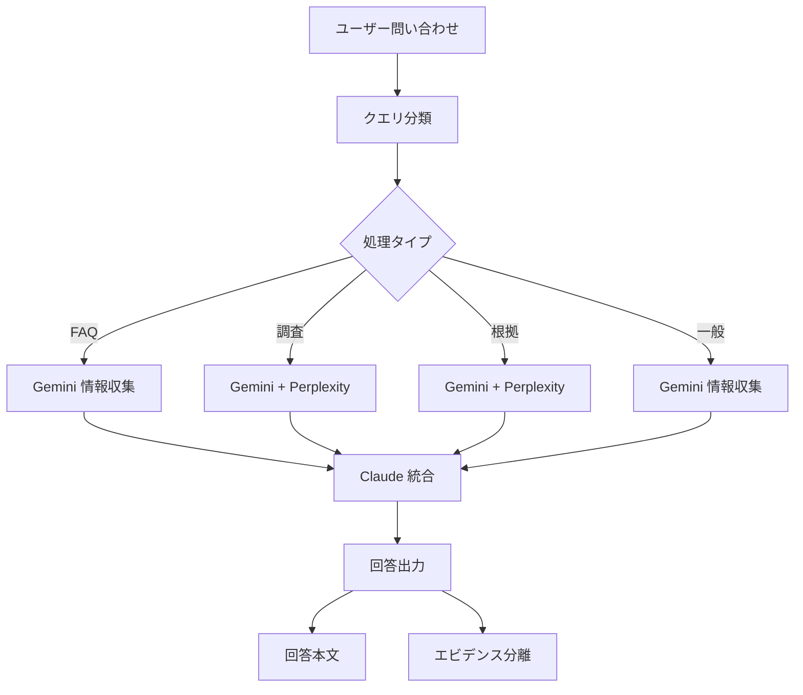

# AIボット回答ロジック

## 処理フロー図



> **注**: OpenAI APIは不使用。Claude + Gemini + Perplexity で構成。

## 1. クエリ分類ロジック

### 処理タイプ判定

```python
from enum import Enum

class QueryType(Enum):
    FAQ = "faq"
    INVESTIGATION = "investigation"
    EVIDENCE = "evidence"
    GENERAL = "general"

def classify_query(query: str) -> QueryType:
    """
    問い合わせを分類

    Returns:
        QueryType: FAQ/Investigation/Evidence/General
    """
    query_lower = query.lower()

    # FAQパターン
    faq_patterns = [
        'パスワード', 'リセット', 'アカウント',
        '申請', '権限', 'ログイン', '作成', '削除'
    ]

    # 調査パターン
    investigation_patterns = [
        'エラー', '障害', 'トラブル', '原因',
        '調査', '分析', '遅い', '動かない'
    ]

    # 根拠パターン
    evidence_patterns = [
        'なぜ', '理由', '根拠', 'ベストプラクティス',
        '推奨', '標準', 'セキュリティ'
    ]

    if any(p in query_lower for p in faq_patterns):
        return QueryType.FAQ
    elif any(p in query_lower for p in evidence_patterns):
        return QueryType.EVIDENCE
    elif any(p in query_lower for p in investigation_patterns):
        return QueryType.INVESTIGATION
    else:
        return QueryType.GENERAL
```

## 2. 並列処理ロジック

### 複数AI同時呼び出し

```python
async def process_query(query: str) -> OrchestratedResponse:
    """
    複数AIを並列で呼び出し、Claudeで統合
    """
    query_type = classify_query(query)

    tasks = []
    ai_used = []

    # Gemini: 情報収集（全タイプ）
    if gemini_available:
        tasks.append(gemini_investigate(query))
        ai_used.append("gemini")

    # Perplexity: 根拠収集（Investigation/Evidence時）
    if perplexity_available and query_type in [QueryType.EVIDENCE, QueryType.INVESTIGATION]:
        tasks.append(perplexity_evidence(query))
        ai_used.append("perplexity")

    # 並列実行
    results = await asyncio.gather(*tasks, return_exceptions=True)
    results = [r for r in results if isinstance(r, AIResult) and r.success]

    # Claude統合
    final_answer = await claude_integrate(query, query_type, results)
    ai_used.append("claude")

    return OrchestratedResponse(
        answer=final_answer['answer'],
        evidence=final_answer['evidence'],
        sources=final_answer['sources'],
        confidence=final_answer['confidence'],
        ai_used=ai_used
    )
```

## 3. 統合ロジック

### Claude統合処理

```python
async def claude_integrate(query: str, query_type: QueryType, ai_results: list) -> dict:
    """
    Claude (Anthropic) で各AIの結果を統合して最終回答を生成
    """
    collected_info = ""
    for result in ai_results:
        collected_info += f"\n【{result.role}（{result.provider}）】\n{result.content}\n"

    prompt = f"""あなたはITサポートの統合エージェントです。
収集された情報を統合し、情シス担当者向けの最終回答を生成してください。

要件:
1. 回答本文は簡潔かつ実用的に
2. 手順がある場合は番号付きリストで
3. 根拠・エビデンスは分離して出力
4. 不確実な情報は明示

【ユーザー質問】
{query}

【問い合わせタイプ】
{query_type.value}

【収集情報】
{collected_info}

出力形式（JSON）:
{{
  "answer": "回答本文",
  "evidence": [{{"source": "ソース名", "url": "URL", "snippet": "関連記述"}}],
  "sources": ["参照URL1", "参照URL2"],
  "confidence": 0.0-1.0
}}
"""

    response = anthropic_client.messages.create(
        model="claude-sonnet-4-20250514",
        max_tokens=2000,
        messages=[{"role": "user", "content": prompt}]
    )

    return parse_json_response(response.content[0].text)
```

## 4. 根拠分離出力

### 出力フォーマット

```json
{
  "answer": "問題の解決方法は以下の通りです：\n1. 設定画面を開く\n2. 該当項目を変更\n3. 保存して再起動",
  "evidence": [
    {
      "source": "Microsoft公式ドキュメント",
      "url": "https://docs.microsoft.com/...",
      "snippet": "この設定は...",
      "reliability": 0.95
    }
  ],
  "sources": [
    "https://docs.microsoft.com/...",
    "https://aws.amazon.com/..."
  ],
  "confidence": 0.88,
  "query_type": "investigation",
  "ai_used": ["gemini", "perplexity", "claude"],
  "processing_time_ms": 31000
}
```

## 5. エラーハンドリング

### フォールバックロジック

```python
async def claude_integrate_with_fallback(query: str, query_type: QueryType, results: list) -> dict:
    """
    Claude統合処理（フォールバック付き）
    """
    # Claudeが利用不可の場合
    if not anthropic_client:
        combined = "\n\n".join([r.content for r in results if r.content])
        return {
            "answer": combined or "回答を生成できませんでした。",
            "evidence": [],
            "sources": [],
            "confidence": 0.5
        }

    try:
        # Claude統合を試行
        result = await claude_integrate(query, query_type, results)
        if result:
            return result
    except Exception as e:
        logger.error(f"Claude統合エラー: {e}")

    # フォールバック: 結果を結合
    combined = "\n\n".join([r.content for r in results if r.content])
    return {
        "answer": combined or "回答を生成できませんでした。",
        "evidence": [],
        "sources": [],
        "confidence": 0.3
    }
```

## 6. キャッシュ戦略

### 回答キャッシュ

```python
# FAQ回答は長期キャッシュ
FAQ_CACHE_TTL = 86400  # 24時間

# 調査結果は短期キャッシュ
INVESTIGATION_CACHE_TTL = 3600  # 1時間

# 根拠情報は中期キャッシュ
EVIDENCE_CACHE_TTL = 7200  # 2時間
```

## 7. パフォーマンス実績

| クエリタイプ | 使用AI | 信頼度 | 処理時間 |
|-------------|--------|--------|----------|
| FAQ | Gemini + Claude | 90% | 約17秒 |
| Investigation | Gemini + Perplexity + Claude | 85% | 約38秒 |
| Evidence | Gemini + Perplexity + Claude | 95% | 約31秒 |
