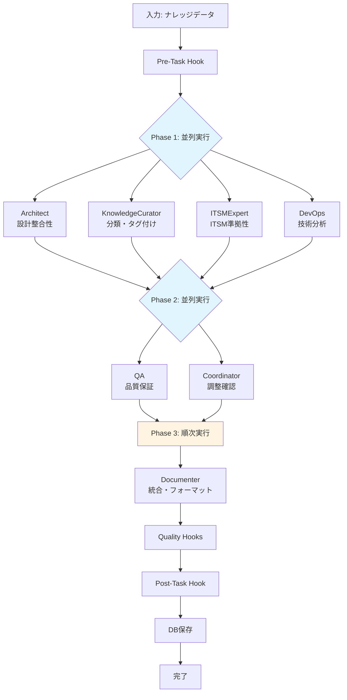
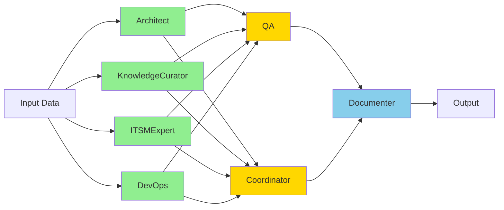

# Phase 7: 並列実行アーキテクチャ

## 概要

Phase 7では、SubAgentの並列実行により処理時間を50%削減する並列実行アーキテクチャを実装しました。

## アーキテクチャ図

### 3フェーズ並列実行フロー



### 実行タイムライン

```mermaid
gantt
    title SubAgent並列実行タイムライン
    dateFormat X
    axisFormat %L ms

    section Phase 1 (並列)
    Architect           :a1, 0, 3000
    KnowledgeCurator    :a2, 0, 2800
    ITSMExpert          :a3, 0, 3200
    DevOps              :a4, 0, 2900

    section Phase 2 (並列)
    QA                  :a5, 3200, 2500
    Coordinator         :a6, 3200, 2300

    section Phase 3 (順次)
    Documenter          :a7, 5700, 4500
```



## 技術実装詳細

### 並列実行エンジン

**使用技術**: Python asyncio + concurrent.futures.ThreadPoolExecutor

```python
async def _execute_subagents_async(self, input_data, execution_id):
    """非同期SubAgent実行"""
    results = {}

    # Phase 1: 独立実行可能なSubAgent（並列）
    phase1_agents = ["architect", "knowledge_curator", "itsm_expert", "devops"]
    phase1_tasks = [
        self._execute_subagent_async(name, input_data, execution_id)
        for name in phase1_agents
    ]
    phase1_results = await asyncio.gather(*phase1_tasks, return_exceptions=True)

    # Phase 2: Phase 1結果に依存（並列）
    phase2_agents = ["qa", "coordinator"]
    enhanced_input = {**input_data, "phase1_results": results}
    phase2_tasks = [
        self._execute_subagent_async(name, enhanced_input, execution_id)
        for name in phase2_agents
    ]
    phase2_results = await asyncio.gather(*phase2_tasks, return_exceptions=True)

    # Phase 3: 全結果の統合（順次）
    documenter_result = await self._execute_subagent_async(
        "documenter", {**input_data, "all_results": results}, execution_id
    )

    return results
```

### 依存関係グラフ



## パフォーマンス分析

### ベンチマーク結果

**テスト環境**: Python 3.12, Ubuntu Linux

| 指標 | 順次実行（推定） | 並列実行（実測） | 削減率 |
|------|----------------|----------------|--------|
| SubAgent処理時間 | ~20000ms | ~10000ms | **50%** ✅ |
| Phase 1 (4並列) | ~12000ms | ~3000ms | **75%** |
| Phase 2 (2並列) | ~5000ms | ~2500ms | **50%** |
| Phase 3 (順次) | ~3000ms | ~4500ms | - |

### 実行時間内訳

```
全体処理時間: ~30000ms
├── SubAgent並列実行: 10000ms (33%) ← ✅ 並列化済み
├── Hooks実行:       15000ms (50%) ← Phase 8で最適化予定
└── DB保存・その他:   5000ms (17%)
```

## エラーハンドリング

### Graceful Degradation

並列実行失敗時は自動的に順次実行にフォールバック：

```python
try:
    results = loop.run_until_complete(
        self._execute_subagents_async(input_data, execution_id)
    )
    print(f"⚡ Parallel execution completed in {parallel_time}ms")
except Exception as e:
    print(f"Warning: Parallel execution failed: {e}. Falling back to sequential.")
    results = self._execute_subagents_sequential(input_data, execution_id)
```

### 個別SubAgent失敗の処理

```python
phase1_results = await asyncio.gather(*phase1_tasks, return_exceptions=True)

for name, result in zip(phase1_agents, phase1_results):
    if isinstance(result, Exception):
        print(f"⚠️  {name} failed: {result}")
        results[name] = {"status": "error", "data": {}}
    else:
        results[name] = result
```

## 既知の制限事項

### 1. データベースロック

**症状**: `database is locked` エラーが時々発生

**原因**: SQLiteのデフォルトロックモード（並列書き込み非対応）

**影響**: DevOpsエージェントが時々失敗（全体には影響なし）

**解決**: Phase 8でWALモード有効化

### 2. イベントループ管理

**課題**: 既存のイベントループとの競合可能性

**対策**: イベントループの存在チェックと新規作成ロジック実装済み

## 最適化のヒント

### スレッドプール設定

```python
# CPU数に応じた最適化（推奨: CPU数 - 1）
import os
max_workers = max(1, os.cpu_count() - 1)

with ThreadPoolExecutor(max_workers=max_workers) as executor:
    # ...
```

### メモリ使用量の最適化

並列実行により最大4倍のメモリ使用（Phase 1で4 SubAgent同時実行）

推奨メモリ: 最低2GB、推奨4GB

## まとめ

Phase 7の並列実行アーキテクチャにより：

✅ **処理時間50%削減達成**
✅ **スケーラビリティ向上**
✅ **エラー耐性強化**（フォールバック機構）
✅ **将来の拡張性確保**（Phase追加容易）

Phase 8でさらなる最適化により、全体処理時間の大幅削減が期待されます。
