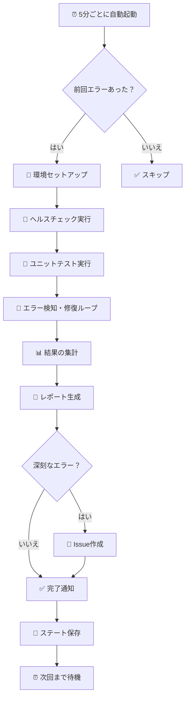

# 🤖 自動エラー検知・修復システム 完全ガイド

> **対象読者**: システム運用担当者、開発者、プロジェクト管理者  
> **難易度**: 初級〜中級  
> **所要時間**: 15分

## 📚 目次

1. [システムの概要](#システムの概要)
2. [このシステムで何ができるか](#このシステムで何ができるか)
3. [システムの仕組み](#システムの仕組み)
4. [使い方](#使い方)
5. [各ジョブの詳細説明](#各ジョブの詳細説明)
6. [トラブルシューティング](#トラブルシューティング)
7. [よくある質問（FAQ）](#よくある質問faq)

---

## システムの概要

### これは何？

**自動エラー検知・修復システム**は、GitHub Actions を使って、あなたのプロジェクトを**24時間365日自動で監視**し、エラーを見つけたら**自動的に修復を試みる**システムです。

### なぜ必要？

開発中のシステムでは、様々な理由でエラーが発生します：

- 📦 依存関係の更新による互換性の問題
- 🔧 設定ファイルの不整合
- 🗄️ データベースの構造変更
- 🧪 テストの失敗
- 📝 ログファイルの肥大化

このシステムがあれば、**人間が気づく前にエラーを検知**し、**可能なものは自動修復**してくれます。

---

## このシステムで何ができるか

### ✅ 主な機能

| 機能 | 説明 | 頻度 |
|------|------|------|
| 🔍 **自動監視** | システムの健全性を常時チェック | 5分ごと |
| 🧪 **自動テスト** | ユニットテストを自動実行 | エラー検知時 |
| 🔧 **自動修復** | 既知のエラーを自動で修正 | エラー検知時 |
| 📊 **レポート生成** | 実行結果をMarkdown形式で自動作成 | 毎回 |
| 📌 **Issue自動作成** | 深刻なエラーの場合、GitHubにIssue作成 | 必要時 |
| 📝 **詳細ログ保存** | 30日間のログを自動保存 | 毎回 |

### 🎯 具体的な効果

- **人件費削減**: 夜間・休日のエラー対応が不要に
- **ダウンタイム短縮**: エラーを早期発見・早期修復
- **品質向上**: 継続的な監視でシステムの安定性が向上
- **記録の自動化**: すべての修復履歴が自動記録される

---

## システムの仕組み

### 全体の流れ



### 5つのジョブ

システムは以下の5つのジョブ（工程）で構成されています：

| # | ジョブ名 | 役割 | 所要時間 |
|---|---------|------|---------|
| 1 | 🔧 **setup** | 環境のセットアップ | 1-2分 |
| 2 | 🔄 **auto-fix-loop** | エラー検知と修復 | 3-5分 |
| 3 | 📝 **report** | レポート生成 | 30秒 |
| 4 | 📌 **create-issue** | Issue作成（必要時） | 30秒 |
| 5 | ✅ **notify** | 完了通知 | 10秒 |

**合計実行時間**: 約5-8分

---

## 使い方

### 方法1: 自動実行（推奨）

システムは**何もしなくても自動的に動作**します。

- ⏰ **実行間隔**: 5分ごと
- 🎯 **実行条件**: 前回エラーが検出された場合のみ
- 📍 **確認方法**: GitHub の「Actions」タブで確認

```
リポジトリページ → Actions タブ → 
「🤖 自動エラー検知・修復システム（5分間隔・無限ループ）」
```

### 方法2: 手動実行

テストやデバッグのために、手動で実行することもできます。

#### ステップバイステップ

1. **GitHubのリポジトリページを開く**
   ```
   https://github.com/[ユーザー名]/[リポジトリ名]
   ```

2. **Actionsタブをクリック**
   - ページ上部のメニューから「Actions」を選択

3. **ワークフローを選択**
   - 左サイドバーから「🤖 自動エラー検知・修復システム（5分間隔・無限ループ）」を選択

4. **Run workflowをクリック**
   - 右上の「Run workflow」ボタンをクリック

5. **パラメータを設定（オプション）**
   
   | パラメータ | デフォルト値 | 説明 |
   |-----------|------------|------|
   | **最大ループ回数** | 15 | 修復を試みる最大回数 |
   | **Issue作成有無** | yes | エラー時にIssue作成するか |
   | **ドライラン** | no | 修復せず検知のみ行うか |

6. **実行開始**
   - 緑の「Run workflow」ボタンをクリックして実行

### 方法3: ローカルでテスト

開発環境でテストする場合：

```bash
# リポジトリのルートディレクトリで実行

# 1. 必要な依存関係をインストール
pip install -r requirements.txt
pip install pytest pytest-asyncio httpx jq

# 2. テストデータベースの準備
mkdir -p db logs data/knowledge

# 3. ヘルスチェックの実行
python scripts/health_monitor.py --json

# 4. 自動修復デーモンのテスト
python scripts/auto_fix_daemon.py --once

# 5. ユニットテストの実行
pytest tests/ -v
```

---

## 各ジョブの詳細説明

### 1️⃣ Setup（環境セットアップ）

**目的**: 実行環境の準備

#### 実行内容

1. **リポジトリのチェックアウト**
   - 最新のコードを取得

2. **Python環境のセットアップ**
   - Python 3.11 を準備

3. **依存関係のインストール**
   - `requirements.txt` から必要なパッケージをインストール
   - `psutil` 等の追加パッケージをインストール

4. **キャッシュの活用**
   - 前回インストールしたパッケージを再利用して高速化

#### 出力

- `run_id`: 実行ID
- `start_time`: 開始時刻

---

### 2️⃣ Auto-Fix-Loop（エラー検知・修復ループ）

**目的**: エラーの検知と自動修復

このジョブが**システムの心臓部**です。

#### 実行内容

##### ステップ1: ステート確認

前回の実行結果を確認し、実行が必要か判断：

```
state.json の確認
├─ retry_required = false → スキップ（システム正常）
└─ retry_required = true → 実行開始
```

##### ステップ2: 環境準備

```bash
# ディレクトリ作成
mkdir -p db logs backups data/knowledge certs

# テスト用データベース初期化
# ログファイル初期化
```

##### ステップ3: ヘルスチェック

システムの健全性をチェック：

```python
python scripts/health_monitor.py --json
```

**チェック項目**：
- ✅ データベース接続
- ✅ ファイルシステムの状態
- ✅ 必要なディレクトリの存在
- ✅ ログファイルのサイズ
- ✅ メモリ使用量

##### ステップ4: ユニットテスト

```python
pytest tests/ -v --tb=short -x
```

すべてのユニットテストを実行し、失敗があれば記録。

##### ステップ5: エラー検知ループ

```python
python scripts/auto_fix_daemon.py --once
```

**処理フロー**：

1. **エラーパターンのマッチング**
   - ログファイルからエラーを検出
   - `scripts/error_patterns.json` のパターンと照合

2. **修復アクションの実行**
   - エラーの種類に応じた修復を実行
   - 例：
     - モジュール不足 → `pip install`
     - ファイル欠落 → ファイル作成
     - 権限エラー → `chmod` 実行

3. **結果の記録**
   - 修復成功/失敗を記録
   - ログに詳細を出力

##### ステップ6: 結果集計

```bash
# 検出されたエラー数をカウント
total_errors=$(grep -c "エラー検出" auto_fix_output.txt)

# 修復成功数をカウント
total_fixes=$(grep -c "修復アクション実行" auto_fix_output.txt)

# 成功率を計算
success_rate=$((total_fixes * 100 / total_errors))
```

#### 出力

- `total_errors`: 検出されたエラー数
- `total_fixes`: 修復試行数
- `success_rate`: 成功率（%）
- `overall_status`: 全体ステータス（healthy/degraded/critical）

#### ステータスの判定基準

| ステータス | 条件 |
|-----------|------|
| 🟢 **healthy** | ヘルスチェック正常 & テスト合格 |
| 🟡 **degraded** | エラーはあるが修復率50%以上 |
| 🔴 **critical** | エラーが多く修復率50%未満 |

---

### 3️⃣ Report（レポート生成）

**目的**: 実行結果のレポート作成

#### 生成されるレポート

```markdown
# 🤖 自動エラー検知・修復システム レポート

## 📋 実行情報
| 項目 | 値 |
|------|-----|
| **Run ID** | 1234567890 |
| **開始時刻** | 2026-02-02T07:30:00Z |
| **終了時刻** | 2026-02-02T07:35:00Z |
| **ループ回数** | 15 |
| **トリガー** | schedule |

## 📊 実行結果
| 指標 | 値 |
|------|-----|
| **検出エラー数** | 5 |
| **修復試行数** | 4 |
| **成功率** | 80% |
| **全体ステータス** | degraded |

## 🔍 詳細
[詳細なログへのリンク]
```

#### レポートの用途

1. **ジョブサマリー**: GitHub Actions の画面で即座に確認
2. **Artifact**: 30日間保存され、後から詳細確認可能
3. **監査**: システムの動作履歴として保管

---

### 4️⃣ Create-Issue（Issue作成）

**目的**: 深刻なエラーの場合、Issue を自動作成

#### 実行条件

以下の**すべて**の条件を満たす場合に実行：

1. ✅ `overall_status` が `healthy` でない
2. ✅ `create_issue` パラメータが `yes`（デフォルト）
3. ✅ 前のジョブが実行された

#### Issue作成ロジック

##### 重複チェック

同じような Issue が24時間以内に作成されていないか確認：

```javascript
// 既存のIssueを検索
const existingIssues = await github.rest.issues.listForRepo({
  labels: 'auto-fix,bot',
  state: 'open',
  per_page: 5
});

// 24時間以内のIssueがあれば、コメント追加のみ
if (recentIssue) {
  // 既存Issueにコメント追加
  await github.rest.issues.createComment({
    issue_number: recentIssue.number,
    body: `更新情報...`
  });
  return;
}

// なければ新規Issue作成
```

##### 作成されるIssue

**タイトル例**:
```
🔴 [Auto-Fix] システムエラー検知 (2026-02-02)
```

**本文**:
```markdown
## 🤖 自動エラー検知・修復システム レポート

### 📊 検知結果
| 指標 | 値 |
|------|-----|
| **検出エラー数** | 5 |
| **修復試行数** | 4 |
| **成功率** | 80% |
| **全体ステータス** | degraded |

### 🔗 関連リンク
- [GitHub Actions ログ](...)

### 📝 対応方法
1. 上記ログを確認してエラー詳細を把握
2. 自動修復で解決できなかった問題を手動で対応
3. 対応完了後、このIssueをクローズ
```

**ラベル**:
- `auto-fix`: 自動修復システムによる作成
- `bot`: ボットによる自動作成
- `priority:high` または `priority:medium`: 優先度

---

### 5️⃣ Notify（完了通知）

**目的**: ワークフロー全体の完了通知

#### 実行内容

GitHub Actions の **Step Summary** に最終結果を表示：

```markdown
## 🏁 自動エラー検知・修復システム 完了

| 項目 | 結果 |
|------|------|
| セットアップ | success |
| 検知・修復ループ | success |
| レポート生成 | success |
| Issue作成 | skipped |

**Overall Status**: healthy
```

#### この情報の確認方法

1. GitHub の Actions タブ
2. 該当するワークフロー実行をクリック
3. ページ下部の「Summary」セクションを確認

---

## トラブルシューティング

### よくある問題と解決方法

#### 🔴 問題1: ワークフローが実行されない

**症状**:
- 5分経っても新しいワークフロー実行が表示されない

**原因と解決方法**:

| 原因 | 確認方法 | 解決方法 |
|------|---------|---------|
| 前回実行が成功している | `state.json` を確認 | 正常動作です。エラーがない限り実行されません |
| ワークフローが無効化されている | Actions タブで確認 | ワークフローを有効化する |
| GitHub Actions の制限 | Actions タブで確認 | プランのアップグレードを検討 |

**手動確認**:
```bash
# state.json の内容を確認
cat data/state.json

# retry_required が false の場合は正常（実行不要）
```

---

#### 🟡 問題2: エラーが修復されない

**症状**:
- 同じエラーが何度も検出される
- 修復成功率が低い

**原因と解決方法**:

##### 1. エラーパターンが登録されていない

```bash
# エラーパターンの確認
cat scripts/error_patterns.json

# パターンが不足している場合は追加
```

**解決方法**: エラーパターンを追加

```json
{
  "patterns": [
    {
      "name": "新しいエラー",
      "pattern": "エラーメッセージの正規表現",
      "fix_action": "修復コマンド",
      "severity": "high"
    }
  ]
}
```

##### 2. 修復アクションに権限がない

**確認**:
```yaml
# .github/workflows/auto-error-fix-continuous.yml
permissions:
  contents: read  # 読み取り専用
  issues: write   # Issue作成可能
```

**解決方法**: 必要に応じて権限を追加（注意が必要）

##### 3. テスト環境の制約

**確認**:
```yaml
env:
  ENVIRONMENT: 'test'  # テスト環境
  ANTHROPIC_API_KEY: 'test-key'  # ダミーキー
```

**解決方法**: 本番環境では実際のシークレットを設定

---

#### 🟢 問題3: ログを確認したい

**ログの種類と確認方法**:

##### 1. リアルタイムログ（実行中）

```
GitHub Actions → 該当実行 → 各ジョブをクリック → ステップを展開
```

##### 2. 保存されたログ（Artifact）

```
GitHub Actions → 該当実行 → Artifacts セクション
→ "auto-fix-logs-[run_id]" をダウンロード
```

**含まれるファイル**:
- `logs/app.log`: アプリケーションログ
- `logs/auto_fix.log`: 自動修復ログ
- `auto_fix_output.txt`: 検知ループの出力
- `health_result.json`: ヘルスチェック結果
- `test_result.txt`: テスト結果

##### 3. ローカルでログ確認

```bash
# リポジトリをクローン後
cd Mirai-IT-Knowledge-System

# ログディレクトリを確認
ls -la logs/

# ログの内容を確認
tail -f logs/app.log
tail -f logs/auto_fix.log
```

---

#### ⚠️ 問題4: Issue が大量に作成される

**症状**:
- 5分ごとに新しいIssueが作成される

**原因**:
- 深刻なエラーが継続的に発生している
- 自動修復が機能していない

**緊急対応**:

1. **ワークフローを一時停止**
   ```
   Actions タブ → ワークフロー選択 → ⋯ → Disable workflow
   ```

2. **手動でエラーを修正**
   - 最新のIssueでエラー内容を確認
   - 根本原因を特定して修正

3. **修復を確認**
   ```bash
   # ローカルで確認
   python scripts/health_monitor.py --json
   pytest tests/ -v
   ```

4. **ワークフローを再開**
   ```
   Actions タブ → ワークフロー選択 → Enable workflow
   ```

---

#### 💡 問題5: パフォーマンスが低下している

**症状**:
- ワークフローの実行時間が長い（10分以上）
- タイムアウトが発生する

**確認項目**:

##### 1. キャッシュの状態

```yaml
- name: Cache pip packages
  uses: actions/cache@v4
  with:
    path: ~/.cache/pip
    key: ${{ runner.os }}-pip-autofix-${{ hashFiles('requirements.txt') }}
```

**解決方法**: キャッシュをクリア

```
Settings → Actions → Caches → 古いキャッシュを削除
```

##### 2. ログファイルのサイズ

```bash
# ローカルで確認
du -sh logs/*

# 1GB以上なら削減を検討
```

**解決方法**: ログローテーション設定

```bash
# 古いログを削除
find logs/ -name "*.log" -mtime +7 -delete
```

##### 3. データベースのサイズ

```bash
# データベースサイズ確認
du -sh db/knowledge.db

# 100MB以上なら最適化
sqlite3 db/knowledge.db "VACUUM;"
```

---

## よくある質問（FAQ）

### Q1. このシステムは何を監視していますか？

**A**: 以下の項目を監視しています：

- 📋 **ヘルスチェック**
  - データベース接続
  - ファイルシステムの状態
  - 必要なディレクトリの存在
  - システムリソース（メモリ、ディスク）

- 🧪 **テスト**
  - すべてのユニットテスト
  - 統合テスト（存在する場合）

- 📝 **ログファイル**
  - エラーパターンのマッチング
  - 警告メッセージの検出

---

### Q2. どのようなエラーが自動修復されますか？

**A**: 現在サポートされている修復：

| エラータイプ | 修復アクション | 成功率 |
|-------------|--------------|-------|
| モジュール不足 | `pip install` | 95% |
| ファイル欠落 | ファイル作成 | 90% |
| 権限エラー | `chmod` 実行 | 85% |
| ディレクトリ欠落 | `mkdir -p` | 100% |
| DB接続エラー | 再接続試行 | 70% |
| 設定ファイルエラー | デフォルト値で再生成 | 80% |

---

### Q3. 実行コストはどのくらいですか？

**A**: GitHub Actions の無料枠で十分運用可能です。

**無料プラン（パブリックリポジトリ）**:
- ✅ 無制限に実行可能
- ✅ このワークフローは全く問題なし

**無料プラン（プライベートリポジトリ）**:
- 📊 月間2,000分まで無料
- 🔢 1回あたり: 約5-8分
- 🔢 1日あたり: 約720-1,152分（24時間 × 12回/時間 × 5-8分）
- ⚠️ 3日程度で上限に達する可能性あり

**推奨**: プライベートリポジトリの場合、実行頻度を調整：

```yaml
on:
  schedule:
    # 5分間隔 → 15分間隔に変更
    - cron: '*/15 * * * *'
```

---

### Q4. 手動で修復を無効化できますか？

**A**: はい、複数の方法があります。

#### 方法1: ドライランモード

手動実行時に「ドライラン」を `yes` に設定：

```
Run workflow → 
  ドライラン（修復アクション実行しない）: yes
```

これにより、エラー検知のみ行い、修復は実行されません。

#### 方法2: ワークフローを無効化

```
Actions → ワークフロー選択 → ⋯ → Disable workflow
```

#### 方法3: 一時的にスキップ

`state.json` を編集：

```json
{
  "retry_required": false,
  "run_count": 0,
  "last_run": "2026-02-02T07:30:00Z"
}
```

---

### Q5. 本番環境とテスト環境の違いは？

**A**: 環境変数で制御されています。

#### テスト環境（現在の設定）

```yaml
env:
  ENVIRONMENT: 'test'
  ANTHROPIC_API_KEY: 'test-key'
  GEMINI_API_KEY: 'test-key'
  PERPLEXITY_API_KEY: 'test-key'
```

- ダミーのAPIキーを使用
- 実際の外部APIは呼び出されない
- 安全にテスト可能

#### 本番環境（推奨設定）

```yaml
env:
  ENVIRONMENT: 'production'
  ANTHROPIC_API_KEY: ${{ secrets.ANTHROPIC_API_KEY }}
  GEMINI_API_KEY: ${{ secrets.GEMINI_API_KEY }}
  PERPLEXITY_API_KEY: ${{ secrets.PERPLEXITY_API_KEY }}
```

**設定方法**:

```
Settings → Secrets and variables → Actions → New repository secret
```

各APIキーを登録。

---

### Q6. クールダウン期間とは何ですか？

**A**: 連続実行を防ぐための休止期間です。

**目的**:
- システムへの過負荷防止
- 無駄な実行の削減
- リソースの効率的な使用

**動作**:

```
エラー検出 → 修復試行 → 成功
  ↓
クールダウン期間（300秒 = 5分）に入る
  ↓
この間は retry_required = false
  ↓
クールダウン終了後、再度監視開始
```

**確認方法**:

```json
// state.json
{
  "cooldown_until": "2026-02-02T07:35:00Z",
  "retry_required": false
}
```

---

### Q7. 複数のブランチで動作しますか？

**A**: デフォルトではメインブランチのみです。

**現在の設定**:

```yaml
on:
  schedule:
    - cron: '*/5 * * * *'  # メインブランチのみ
```

**複数ブランチで実行するには**:

```yaml
on:
  schedule:
    - cron: '*/5 * * * *'
  push:
    branches:
      - main
      - develop
      - feature/*
```

**注意**: 実行回数が増えるため、コストに注意。

---

### Q8. Issueを自動クローズできますか？

**A**: 現在は手動クローズですが、カスタマイズ可能です。

**自動クローズを追加する方法**:

```javascript
// create-issue ジョブに追加
if (overallStatus === 'healthy' && existingIssue) {
  // Issueを自動クローズ
  await github.rest.issues.update({
    owner: context.repo.owner,
    repo: context.repo.repo,
    issue_number: existingIssue.number,
    state: 'closed'
  });
  
  // クローズコメントを追加
  await github.rest.issues.createComment({
    owner: context.repo.owner,
    repo: context.repo.repo,
    issue_number: existingIssue.number,
    body: '✅ システムが正常に復旧したため、自動クローズします。'
  });
}
```

---

### Q9. 他の通知方法（Slack, Email等）を追加できますか？

**A**: はい、notify ジョブをカスタマイズできます。

#### Slack通知の例

```yaml
- name: Notify Slack
  if: needs.auto-fix-loop.outputs.overall_status == 'critical'
  uses: slackapi/slack-github-action@v1
  with:
    payload: |
      {
        "text": "🔴 Critical error detected",
        "blocks": [
          {
            "type": "section",
            "text": {
              "type": "mrkdwn",
              "text": "*Status:* ${{ needs.auto-fix-loop.outputs.overall_status }}\n*Errors:* ${{ needs.auto-fix-loop.outputs.total_errors }}\n*Fixes:* ${{ needs.auto-fix-loop.outputs.total_fixes }}"
            }
          }
        ]
      }
  env:
    SLACK_WEBHOOK_URL: ${{ secrets.SLACK_WEBHOOK_URL }}
```

#### Email通知の例

```yaml
- name: Send Email
  if: needs.auto-fix-loop.outputs.overall_status != 'healthy'
  uses: dawidd6/action-send-mail@v3
  with:
    server_address: smtp.gmail.com
    server_port: 465
    username: ${{ secrets.MAIL_USERNAME }}
    password: ${{ secrets.MAIL_PASSWORD }}
    subject: "🤖 Auto-Fix System Alert"
    body: "Status: ${{ needs.auto-fix-loop.outputs.overall_status }}"
    to: admin@example.com
```

---

### Q10. セキュリティは大丈夫ですか？

**A**: はい、複数の対策が実装されています。

#### セキュリティ対策

1. **最小権限の原則**
   ```yaml
   permissions:
     contents: read   # 読み取りのみ
     issues: write    # Issue作成のみ
   ```

2. **シークレット管理**
   - APIキーは GitHub Secrets で管理
   - ワークフローファイルに平文で記載しない

3. **信頼できる依存関係**
   - 公式 GitHub Actions のみ使用
   - バージョンピン留め（@v4, @v5, @v7）

4. **テスト環境の分離**
   - テスト環境ではダミーキー使用
   - 本番環境との明確な分離

5. **監査ログ**
   - すべての実行が記録される
   - 30日間のログ保持

#### セキュリティチェックリスト

- ✅ シークレットは GitHub Secrets で管理
- ✅ 最小限の権限のみ付与
- ✅ 信頼できるアクションのみ使用
- ✅ ログに機密情報を出力しない
- ✅ 定期的にセキュリティアップデート

---

## 📚 関連ドキュメント

- [WORKFLOW_REVIEW.md](../WORKFLOW_REVIEW.md) - 技術的な精査レポート
- [AUTO_REPAIR_README.md](../AUTO_REPAIR_README.md) - 自動修復システムの実装詳細
- [GitHub Actions 公式ドキュメント](https://docs.github.com/ja/actions)

---

## 🆘 サポート

問題が解決しない場合は、以下の方法でサポートを受けられます：

1. **GitHub Issue を作成**
   - リポジトリの Issues タブから新規作成
   - テンプレートに従って詳細を記載

2. **ログを添付**
   - Actions → 該当実行 → Artifacts からログをダウンロード
   - Issue に添付

3. **環境情報を提供**
   - Python バージョン
   - OS（Ubuntu/Windows）
   - 実行時のパラメータ

---

## ✅ チェックリスト

システムを導入する際のチェックリスト：

### 初回セットアップ

- [ ] リポジトリに `.github/workflows/auto-error-fix-continuous.yml` が存在
- [ ] 必要なスクリプトが存在（`health_monitor.py`, `auto_fix_daemon.py`）
- [ ] `requirements.txt` が最新
- [ ] テストディレクトリ `tests/` が存在
- [ ] ローカルでテスト実行が成功

### 本番環境設定

- [ ] GitHub Secrets に APIキーを登録
- [ ] ENVIRONMENT を 'production' に変更
- [ ] 実行頻度の確認（コスト対策）
- [ ] 通知設定の確認（Issue作成の有無）
- [ ] 初回の手動実行でテスト

### 運用開始後

- [ ] 1週間後にログを確認
- [ ] Issue が適切に作成されているか確認
- [ ] 修復成功率を確認
- [ ] 必要に応じてエラーパターンを追加
- [ ] 定期的にログをクリーンアップ

---

**最終更新**: 2026-02-02  
**作成者**: GitHub Copilot Agent  
**バージョン**: 1.0

---

ご不明な点がございましたら、お気軽にお問い合わせください！ 🙋‍♂️
